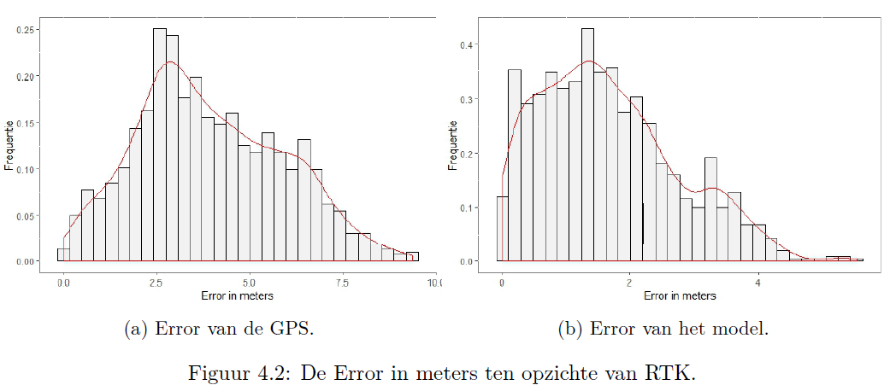
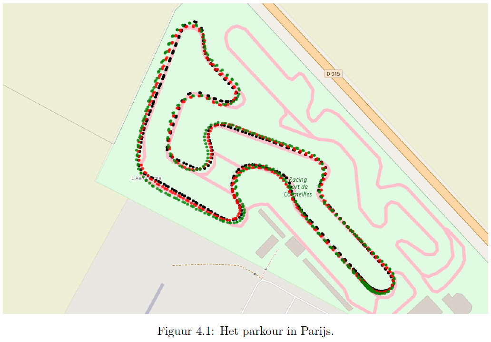

# Localization using a Kalman Filter
This repository is a stripped down and slightly more clean variant of a private repository. The private repo also contains the data that was used and the data analysis performed in R.

## Context
During an "Innovation project" course (11-2018) I joined [CleanMobility](https://cleanmobilityhva.nl/), a team at the University that focussed on building energy efficient vehicles. I had the task of designing and implementing a Kalman Filter to improve the accuracy of the GPS of the vehicles using data from the other sensors. The timeframe for the assignment was three months. 
 
The repository contains the Kalman filter implemented in Python and C. Both using the same logic. It also contains the report written for the project (in Dutch). 

## Results from the report:
The algorithm was tested on sensor data from a race in Paris. Real-Time Kinematic data of the tracks was used the ground truth. The Kalman Filter reduced the average location error from 3.94m to 1.65, it also showed smoother curves when plotting the rounds. The histogram of errors can be seen below:

The report also shows plots which map the datapoints to the actual track. The image below shows the race in Paris. The black dots are measure by RTK and are considered the ground truth. Green was measured by the GPS and the red dots were calculated by the algorithm.

